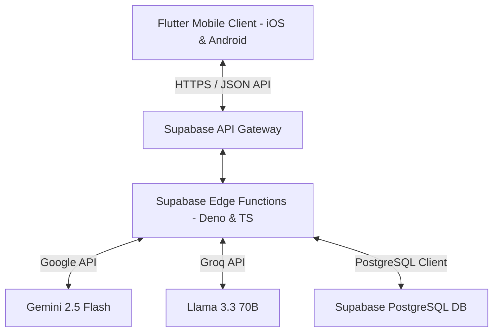

# 🛠 Teknoloji Yığını (Tech Stack & Architecture)

**Proje:** Persona Mirror  
**Katmanlar:** Frontend (Flutter Mobil) · Backend (Supabase Edge Functions) · AI (Gemini & Groq APIs)

---

## 1. Mimari Genel Bakış
Persona Mirror, tamamen **modüler, decoupled (bağımsız) ve genişletilebilir** bir mikro-servis mimarisine sahiptir. Mobil istemci (Frontend) ve Sunucu (Backend) birbirlerinden tamamen bağımsızdır; backend standart HTTP JSON API yapısında tasarlandığından, gelecekte web, desktop veya farklı entegrasyonlara kolayca hizmet verebilir.

---

## 2. Kullanılan Teknolojiler & Seçim Gerekçeleri

### 2.1. İstemci Katmanı (Frontend)
- **Teknoloji:** **Flutter (Dart)**
- **Gerekçe:**
  - **Tek Kod Tabanı (Single Codebase):** Hem iOS hem de Android için native performans sunan arayüzü tek bir kod tabanıyla geliştirerek zaman ve işgücünden tasarruf edilmiştir.
  - **Riverpod State Management:** Uygulamanın durum yönetimini (sohbet akışı, analiz yüklenmesi, kullanıcı session'ı) hatasız ve reaktif olarak yönetmek için tercih edilmiştir.
  - **GoRouter:** Ekranlar arası geçişleri (Splash -> Login -> Dashboard -> Simulation -> Analysis) güvenli ve parametrik olarak yönetmek için standart yönlendirici olarak seçilmiştir.

### 2.2. Sunucu & Veritabanı Katmanı (Backend)
- **Teknoloji:** **Supabase (Edge Functions & Postgres & Auth)**
- **Gerekçe:**
  - **Supabase Edge Functions (Deno / TypeScript):** Sunucusuz (Serverless) yapısı sayesinde backend maliyetini minimize eder, otomatik ölçeklenir ve API çağrılarını milisaniyeler seviyesinde yanıtlar.
  - **Decoupled API Yapısı:** Backend tamamen bağımsız bir API olarak kurgulanmıştır. Mobil uygulama sadece bu API'ye JSON istekleri atar. İleride web arayüzü eklendiğinde backend'de hiçbir değişiklik yapılması gerekmez.
  - **Row Level Security (RLS) ve Postgres:** PostgreSQL'in güçlü ilişkisel veri yapısı, RLS politikalarıyla birleştirilerek her kullanıcının yalnızca kendi senaryolarını, oturumlarını ve analizlerini görebilmesi garanti altına alınmıştır.

### 2.3. Yapay Zeka Katmanı (LLM Services)
- **Teknolojiler:** **Gemini 2.5 Flash** & **Groq (Llama 3.3 70B)**
- **Gerekçe:**
  - **Çift Katmanlı LLM Altyapısı (Fallback Mechanism):** Ana motor olarak ultra-hızlı, yüksek bağlam pencereli ve JSON modu desteği bulunan **Gemini 2.5 Flash** kullanılmaktadır. Gemini servisinin erişilemez olması veya kota aşımı durumunda backend otomatik olarak **Groq API (Llama 3.3-70b-versatile)** modeline geçiş yapar (High Availability).
  - **Yüksek Hız & Düşük Latency:** Karakter simülasyonlarında ve diyaloglarda kullanıcı deneyiminin bozulmaması için 1-3 saniye aralığında yanıt üretebilen bu iki model seçilmiştir.

---

## 3. Geliştirme Sürecinde Yapay Zeka (AI) Kullanımı

Bu proje, modern **AI-assisted software engineering (yapay zeka destekli yazılım mühendisliği)** metodolojisiyle geliştirilmiştir. Geliştirme sürecinde yapay zeka ajanları ve araçları şu kritik görevleri üstlenmiştir:

1. **Prompt Mühendisliği & Karakter Modelleme:** LLM'lerin birer robottan ziyade gerçekçi, günlük Türkçe konuşan (`colloquial`), duygusal tepkiler (duraksama, ünlem vb.) veren karakterler gibi davranması için karmaşık sistem promptları AI yardımıyla tasarlanmış ve optimize edilmiştir.
2. **Backend API ve Veritabanı Tasarımı:** Supabase veritabanı şeması, migrasyon dosyaları (`.sql`) ve API kontratları AI ile birlikte tasarlanmıştır. Edge function'lardaki TypeScript hata yönetimi ve CORS entegrasyonu yapay zekayla test edilerek yazılmıştır.
3. **Frontend Riverpod Notifier'ları:** Flutter tarafındaki state management yapısı, Riverpod notifier şablonları ve GoRouter yönlendirmeleri AI ile birlikte kodlanarak yazım hataları minimize edilmiştir.
